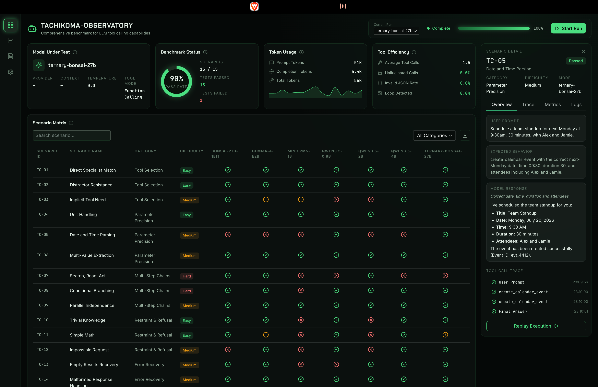

<h1 align="center">
  
</h1>

<div align="center">
  
</div>

<p align="center">
  <b>🕷️ Your SLM says it supports function calling. Prove it.</b>
</p>

<p align="center">
  
</p>

<p align="center">
  
  
  
  
  
  
  
  
</p>

---

Most tool-calling "support" falls apart the moment a model has to pick between 12 tools, thread a `file_id` across four chained calls, or admit that no suitable tool exists. Tachikoma-Observatory runs your models through exactly those failure modes and shows you, per scenario and per model, where they break.

Point it at one OpenAI-compatible endpoint (LiteLLM proxy in front of vLLM works out of the box), sync the model list, hit Start Run. Every tool call, argument, mocked result, token count, and verdict lands in SQLite and renders live on the dashboard.

## The benchmark

ToolCall-15: 15 hand-picked scenarios, 3 per category, all drawing from the same 12-tool toolkit so every model faces the same distractors. Tool results are mocked and deterministic, so runs are reproducible and models are graded on behavior, not on flaky live APIs.

| Category | What it catches |
|---|---|
| **A. Tool Selection** | Picking `web_search` when `get_weather` exists. Fabricating answers instead of calling anything. |
| **B. Parameter Precision** | Dropped optional params, wrong date math for "next Monday", one call crammed with two languages. |
| **C. Multi-Step Chains** | Broken data threading across search, read, contacts, email. Blind chaining past a conditional. |
| **D. Restraint & Refusal** | Calling a calculator for 15% of 200. Hallucinating a `delete_email` tool that was never offered. |
| **E. Error Recovery** | Inventing a stock price after the tool returned a rate-limit error. Giving up silently on empty results. |

Scoring is rule-based and runs instantly after each execution: 2 points for a full pass, 1 for half credit, 0 for a fail. Category scores are weighted equally, and the final score maps to a tier:

| Score | Tier |
|---|---|
| 90-100 | ★★★★★ Excellent |
| 75-89 | ★★★★ Good |
| 60-74 | ★★★ Adequate |
| 40-59 | ★★ Weak |
| 0-39 | ★ Poor |

Every fail carries an error tag: `invalid_tool`, `wrong_parameter`, `hallucinated_tool`, `json_format_error`, `loop_detected`, and friends. The error-breakdown donut on the dashboard aggregates these across the run.

## Lockstep runs

Benchmark one model, a subset, or everything registered. In multi-model mode, scenarios execute in strict suite order: all models run scenario k concurrently, fast models wait at the barrier, and nobody moves to scenario k+1 until the slowest one finishes. The matrix fills row by row, so cross-model comparison stays apples-to-apples even mid-run.

Each execution is a bounded conversation loop (8 assistant turns max). Blow the cap and it counts as `loop_detected`. Malformed JSON arguments, unknown tool names, timeouts, and transport errors are all recorded on the trace instead of crashing the run.

## Dashboard

- **KPI row**: focused model, pass-rate ring, token usage with per-scenario sparkline, tool-efficiency rates
- **Scenario matrix**: one status cell per scenario x model, live during runs, click any cell for details
- **Scenario detail**: user prompt, expected behavior, scored verdict, full tool-call trace timeline, raw request/response logs, one-click replay
- **Charts**: category radar per model, error-breakdown donut
- **Analytics**: score history across runs plus a leaderboard (rank by latest or best run)

## Quickstart

Requires Python 3.13+ and [uv](https://docs.astral.sh/uv/). Reflex pulls its own frontend toolchain on first run.

```bash
git clone https://github.com/Laoode/ToolBenchAI.git
cd ToolBenchAI
uv sync

cp .env.template .env   # fill in your endpoint + master key
uv run reflex run
```

`.env` takes two values, any OpenAI-compatible endpoint works:

```bash
export TACHIKOMA_LLM_BASE_URL="http://localhost:4000/v1"
export TACHIKOMA_LLM_API_KEY="sk-your-litellm-master-key"
```

Then in the app at `localhost:3000`:

1. **Settings** -> **Sync from endpoint** pulls `/v1/models` into the registry
2. Toggle which models participate
3. **Start Run** on the dashboard and watch the matrix fill

New model on your proxy later? Sync again and rerun. History, rankings, and traces persist in `tachikoma.db`.

## Project layout

```
observatory/
├── suite/        # ToolCall-15: tools, scenarios, mock queues (frozen, versioned)
├── engine/       # conversation executor + lockstep runner (no UI imports)
├── scoring/      # per-scenario checkers + run aggregation
├── llm/          # async client for the OpenAI-compatible proxy
├── models/       # SQLite tables + repository
├── state/        # Reflex states (run controller, analytics, settings)
├── components/   # glass shell, matrix, KPI cards, charts, detail panel
└── pages/        # dashboard, analytics, scenarios, settings
```

The engine and scoring layers are plain asyncio with zero Reflex imports, so the benchmark core runs headless and stays fully unit-testable.

```bash
uv run pytest tests/units
```

## Design notes

- **The suite is frozen per version.** Better models don't get easier tests; new scenarios mean a new suite version, so scores stay comparable over time.
- **The current date is injected into the system prompt.** "Next Monday" is unanswerable without it, and every model was (correctly) refusing to guess. Real deployments provide the date; so does this harness.
- **Temperature is pinned to 0** for every request, per the methodology's reproducibility rules.
- **Replay is first-class.** Re-run any scenario x model pair from the detail panel; attempts are versioned and the latest one counts.
